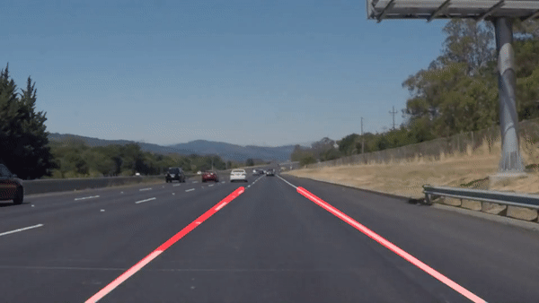
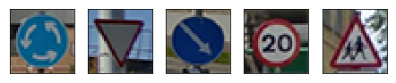
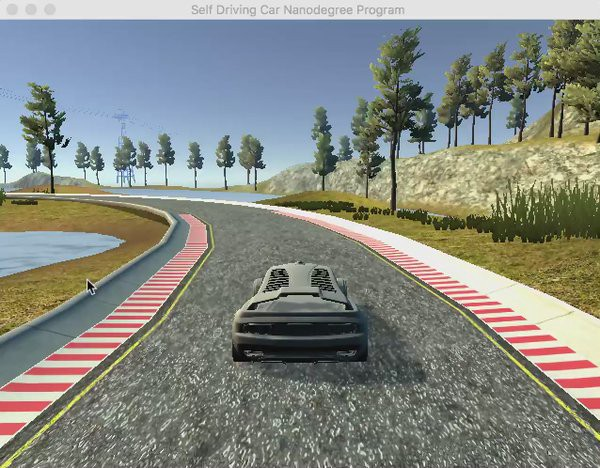
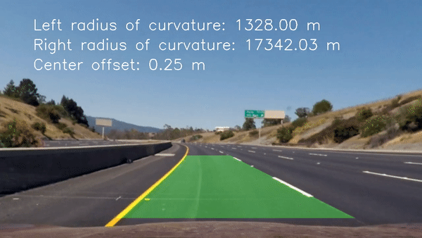

# Self Driving Car Nanodegree

This repository contains the source code and write-ups of all the projects I've done in the **[Udacity Self-Driving Car Engineer Nanodegree](https://www.udacity.com/course/self-driving-car-engineer-nanodegree--nd013)**.

Enjoy! :-)
    
---
## Projects

<table style="width:100%">

  <tr>
    <th>
    	<h2>
       <a href="./project1-Finding_Lane_Lines">P1 - Finding Lane Lines</a>
       </h2>
    </th>
  </tr>
  <tr>
    <td>
      
      

             
      

       
           Detected highway lane lines on a video stream. Used OpencV image analysis techniques to identify lines, including Hough Transforms and Canny edge detection.
    </td>
  </tr>
  
  <tr>
    <th>
    	<h2>
       <a href="./project2-Traffic_Sign_Classifier">P2 - Traffic Sign Classifier</a>
       </h2>
    </th>
  </tr>
  <tr>
    <td>
      
      

           
      

       
           Built and trained a deep neural network to classify traffic signs, using TensorFlow. Experimented with different network architectures. Performed image pre-processing and validation to guard against overfitting.
    </td>
  </tr>
  
  <tr>
    <th>
    	<h2>
       <a href="./project3-Behavioral_Cloning">P3 - Behavioral Cloning</a>
       </h2>
    </th>
  </tr>
  <tr>
    <td>
      
      

            
      

       
           A car drives in a simulated environment by cloning the behavior seen during training mode. Leveraging TensorFlow and Keras, a deep learning network predicts the proper steering angle given training examples.
    </td>
  </tr>
  
  <tr>
    <th>
    	<h2>
       <a href="./project4-Advanced_Lane_Finding">P4 - Advanced Line Finding</a>
       </h2>
    </th>
  </tr>
  <tr>
    <td>
      
      

            
      

       
           Built an advanced lane-finding algorithm using distortion correction, image rectification, color transforms, and gradient thresholding. Identified lane curvature and vehicle displacement. Overcame environmental challenges such as shadows and pavement changes.
    </td>
  </tr>
  
  <tr>
    <th>
    	<h2>
       <a href="./project5-Vehicle_Detection">P5 - Vehicle Detection</a>
       </h2>
    </th>
  </tr>
  <tr>
    <td>
      
      

            
      

       
           Created a vehicle detection and tracking pipeline with OpenCV, histogram of oriented gradients (HOG), and support vector machines (SVM). Implemented the same pipeline using a deep network to perform detection. Optimized and evaluated the model on video data from a automotive camera taken during highway driving
    </td>
  </tr>

  
</table>
 
